# Tosa (Translate OCR Selection Autohotkey)

Tosa是一款仿[Bob](https://bobtranslate.com/)、[PopClip](https://pilotmoon.com/popclip/).的屏幕取词、OCR、翻译、取色工具，使用Tauri、Vite、Vue3开发。

在 [DTA](https://github.com/danger-dream/dta) 的基础上进行了完善，自用很久了，看到还有人Star DTA，把这个也开源了吧。

## images

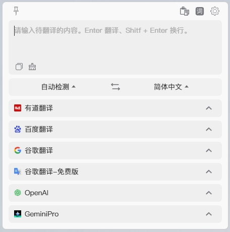

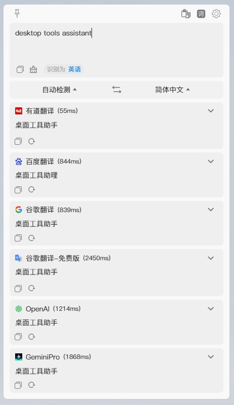

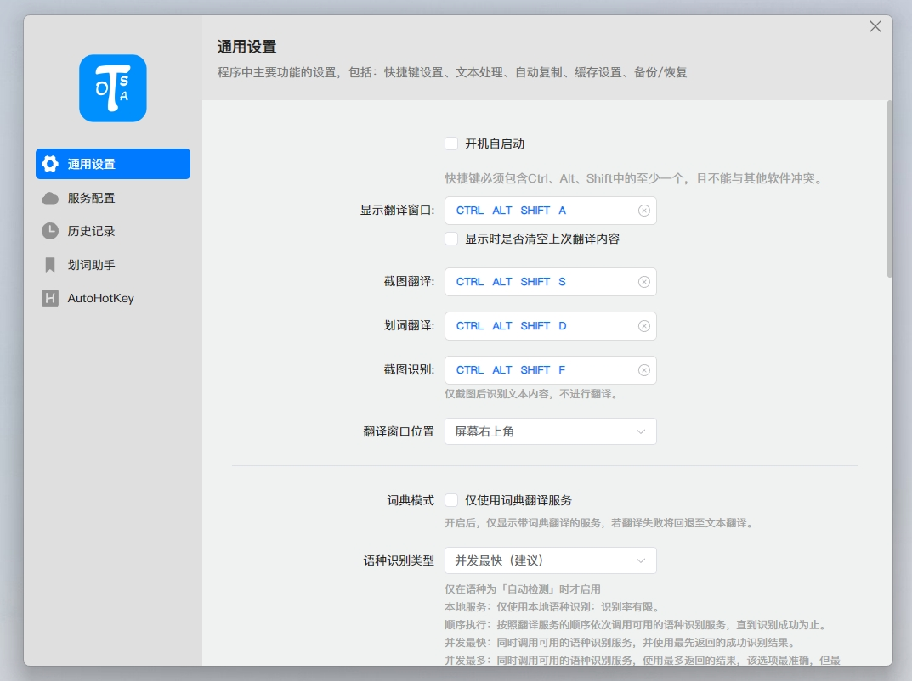
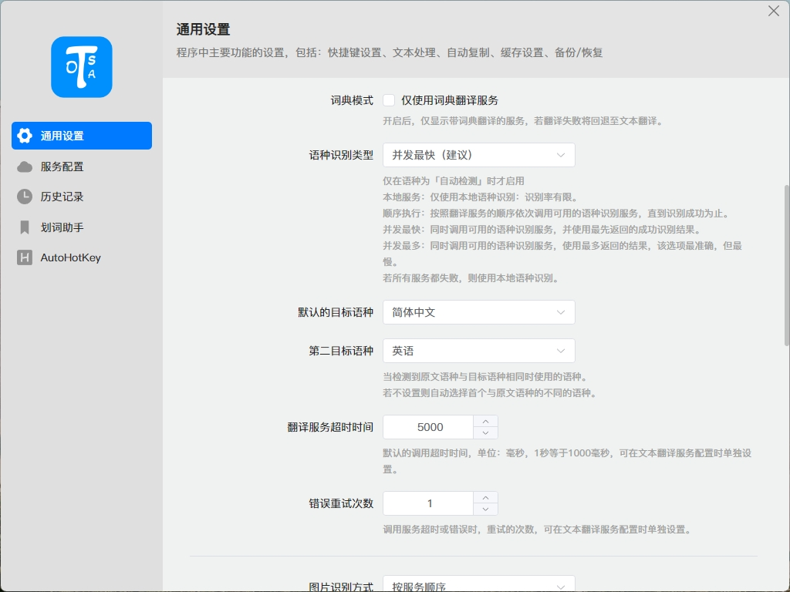
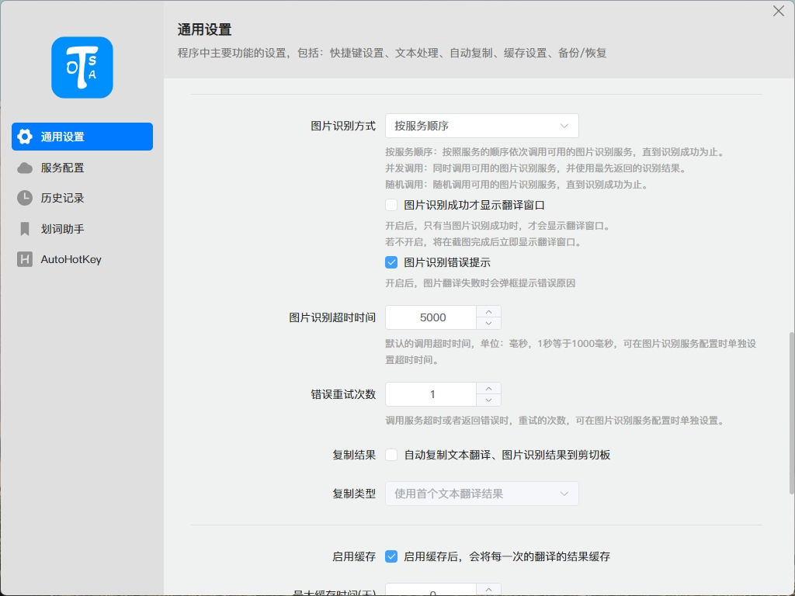
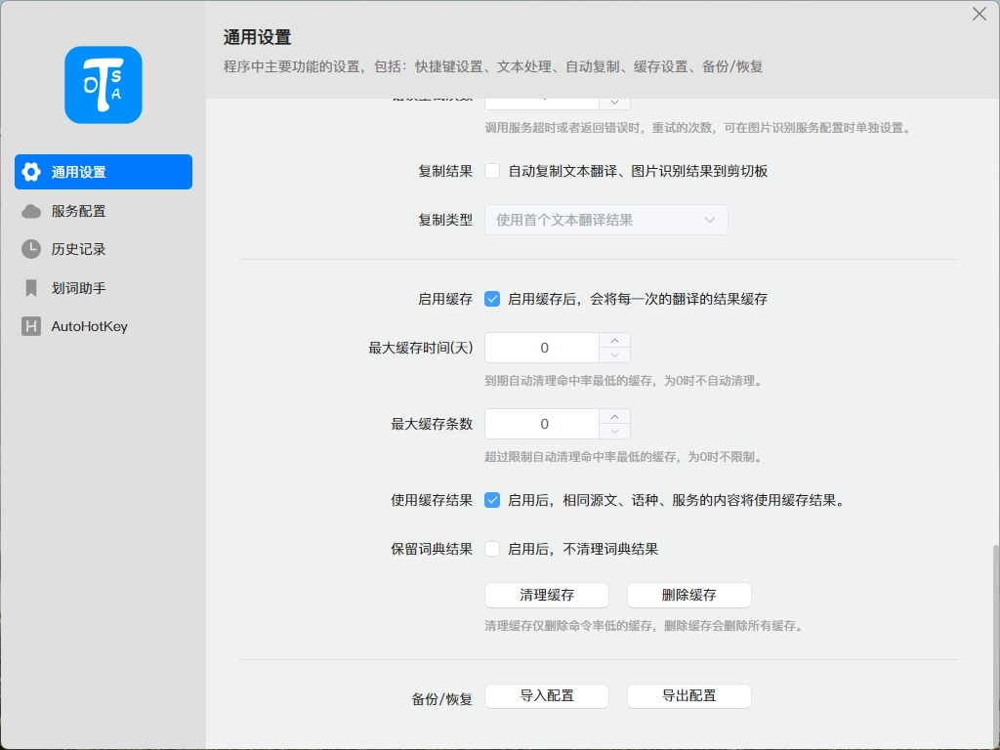

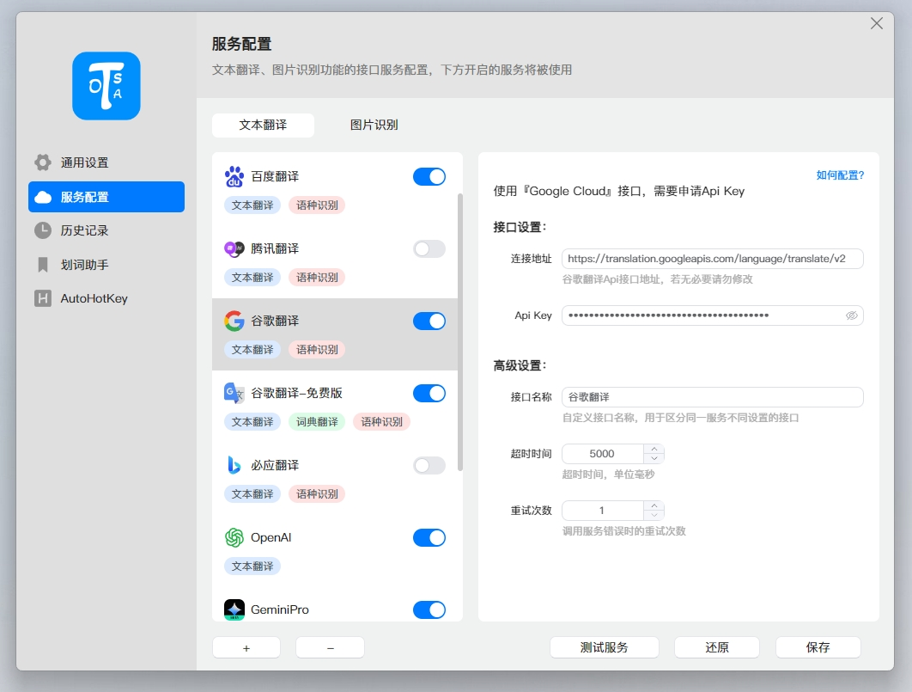
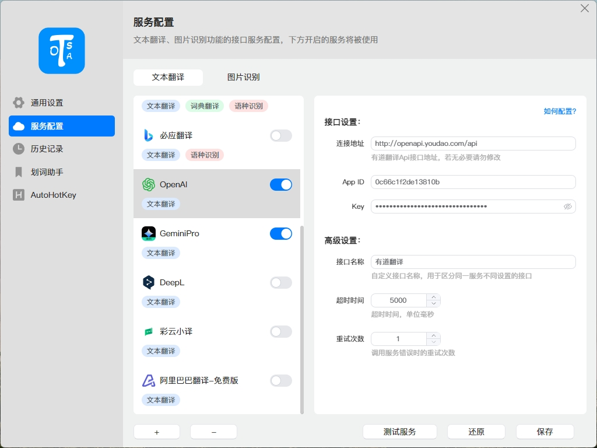

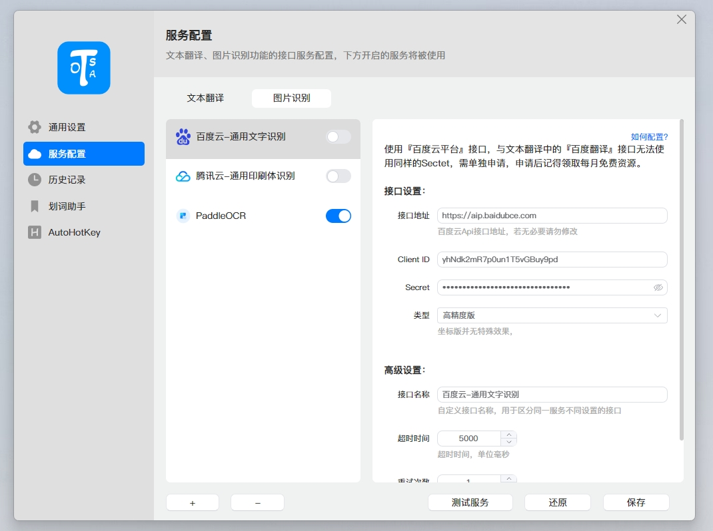

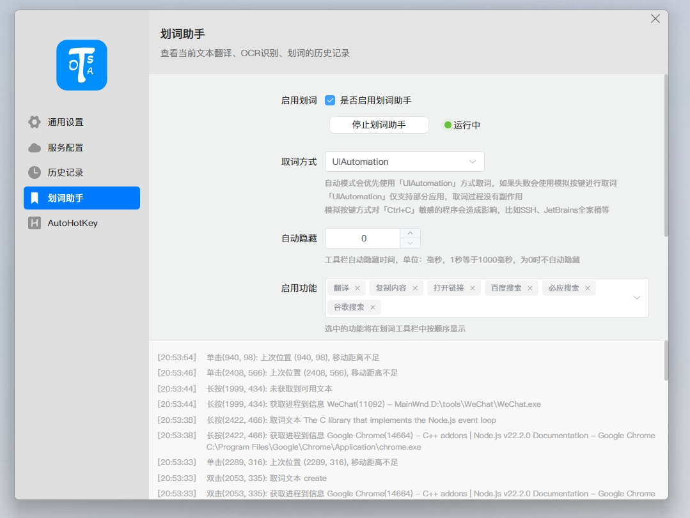

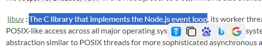

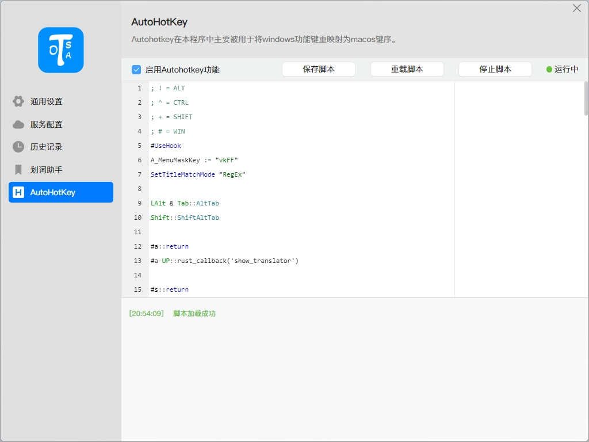


## AutoHotKey Script

```AutoHotKey
; ! = ALT
; ^ = CTRL
; + = SHIFT
; # = WIN
#UseHook
A_MenuMaskKey := "vkFF"
SetTitleMatchMode "RegEx"

LAlt & Tab::AltTab
Shift::ShiftAltTab

#a::return
#a UP::rust_callback('show_translator')

#s::return
#s UP::rust_callback('screenshot_translate')

#d::return
#d UP::rust_callback('selection_translate')

#f::return
#f UP::rust_callback('screenshot_recognizer')


#HotIf WinActive("ahk_exe i)(.*?)Jetbrains(.*?)\.exe$") == 0

!c::Send "^c"     ;alt + c -> ctrl + c
!x::Send "^x"     ;alt + x -> ctrl + x
!v::Send "^v"     ;alt + v -> ctrl + v
!a::Send "^a"     ;alt + a -> ctrl + a
!s::Send "^s"     ;alt + s -> ctrl + s
!w::              ;alt + w -> ctrl + w | ctrl + alt + z | esc
{
	if (WinActive("ahk_exe WeChat.exe") != 0) {
		if (WinActive("ahk_class ImagePreviewWnd") != 0) {
			Send "{esc}"
		} else {
			Send "^!z" ;ctrl + alt + z
		}
	} else {
		Send "^w" ;ctrl + w
	}
	Return
}

!1::Send "^1"
!2::Send "^2"
!3::Send "^3"
!4::Send "^4"
!5::Send "^5"
!6::Send "^6"
!7::Send "^7"
!8::Send "^8"
!9::Send "^9"

!z::Send "^z"     ;alt + z -> ctrl + z
!r::Send "^r"     ;chrome alt + r -> ctrl + r
!+z::             ;chrome alt + shift + z -> ctrl + shift + t
{
	if (WinActive("ahk_exe chrome.exe") != 0 || WinActive("ahk_exe msedge.exe") != 0) {
		Send "^+t"
	}
	Return
}
!t::Send "^t"			   ;alt + t -> ctrl + t
!q::Send "!{F4}"  ;alt + q -> alt + F4
!f::Send "^f"     ;alt + f -> ctrl + f
!LButton::Send "^{Click Left}"  ;alt + mouse left -> ctrl + mouse left
!Backspace::Send "{Delete}"     ;alt + c -> delete
!Left::Send "{Home}"			;alt + left -> Home
!Right::Send "{End}"            ;alt + right -> End
!+Left::Send "+{Home}"          ;alt + shift + left -> shift + Home
!+Right::Send "+{End}"          ;alt + shift + right -> shift + End
!Up::Send "{PgUp}"
!Down::Send "{PgDn}"
#HotIf

#HotIf WinActive("ahk_exe i)(.*?)Jetbrains(.*?)\.exe$") == 0 && WinActive("ahk_exe Code.exe") == 0
#Left::Send "{Home}"
#+Left::Send "+{Home}"
#Right::Send "{End}"
#+Right::Send "+{End}"
#Up::Send "{PgUp}"
#Down::Send "{PgDn}"
#HotIf


#HotIf WinActive("ahk_exe i)(.*?)Jetbrains(.*?)\.exe$") != 0 or WinActive("ahk_exe Code.exe") != 0
#Left::Send "^{Left}"
#+Left::Send "^+{Left}"
#Right::Send "^{Right}"
#+Right::Send "^+{Right}"
#HotIf
```

## Other
* src/Background.ts中定义了Electron的api，但未做相关实现
* 历史记录、缓存功能实现了功能，但未写完UI，可自行实现